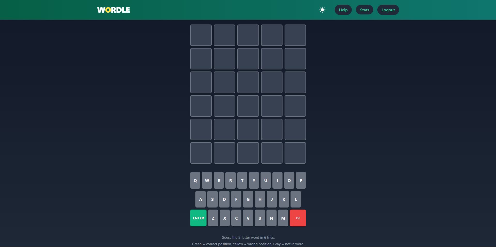
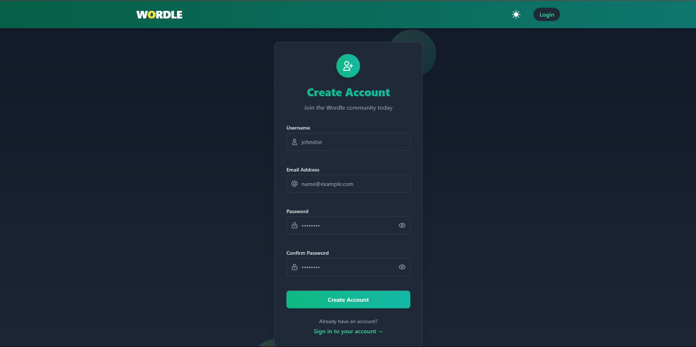

# 🎮 Wordle - Word Guessing Game

<div align="center">
  
  
  
  
  
</div>

A full-featured Wordle clone built with the MERN stack (MongoDB, Express.js, React, Node.js) featuring user authentication, game history, statistics tracking, beautiful animations, and dark/light mode toggle.

## 📱 Screenshots

<div align="center">
  <h3>Game Board</h3>
  
  <p>Main game interface with interactive keyboard and dark mode support</p>
  
  <h3>Login Page</h3>
  
  <p>Secure authentication with JWT</p>
  
  <h3>Registration Page</h3>
  
  <p>User registration with form validation</p>
</div>

## ✨ Features

- **🔐 User Authentication** - Secure login and registration with JWT
- **🎲 Daily Word Generation** - New words to challenge yourself every day
- **🎨 Visual Feedback** - Beautiful animations and color-coded tiles
- **⌨️ Virtual Keyboard** - Interactive keyboard with color-coded keys
- **📊 Statistics Tracking** - Track your wins, streaks, and guess distribution
- **🌓 Dark/Light Mode** - Toggle between dark and light themes with smooth transitions
- **📱 Responsive Design** - Play on any device with a fully responsive UI
- **🎯 Toast Notifications** - Elegant toast messages for game feedback
- **🌙 Clean UI** - Modern, minimalist interface with smooth animations
- **🚀 Performance Optimized** - Fast loading and smooth gameplay

## 🏗️ Project Structure

```
WordleClone/
├── client/              # React frontend
│   ├── public/          # Static files
│   └── src/             # React source code
│       ├── components/  # Reusable components
│       ├── contexts/    # React contexts (Auth, Game, Theme)
│       ├── pages/       # Page components
│       └── styles/      # Component-specific styles
└── server/              # Express.js backend
    ├── controllers/     # Route controllers
    ├── middleware/      # Express middleware
    ├── models/          # Mongoose models
    ├── routes/          # API routes
    └── utils/           # Utility functions
```

## 🚀 Getting Started

### Prerequisites

- Node.js (v14+)
- npm or yarn
- MongoDB Atlas account or local MongoDB installation

### 🔧 Server Setup

1. **Clone the repository**

   ```bash
   git clone https://github.com/yourusername/wordle-clone.git
   cd wordle-clone
   ```

2. **Navigate to the server directory**

   ```bash
   cd server
   ```

3. **Install dependencies**

   ```bash
   npm install
   ```

4. **Create a `.env` file** in the server directory with the following variables:

   ```
   PORT=5000
   MONGO_URI=mongodb+srv://<username>:<password>@cluster0.example.mongodb.net/wordledb?retryWrites=true&w=majority
   JWT_SECRET=your_jwt_secret_key_here
   ```

   Replace `<username>`, `<password>`, and the connection string with your MongoDB credentials.

5. **Seed the database with words**

   ```bash
   node utils/seedDatabase.js
   ```

6. **Start the server**
   ```bash
   npm start
   # or for development with auto-reload
   npm run dev
   ```

### 💻 Client Setup

1. **Navigate to the client directory**

   ```bash
   cd ../client
   ```

2. **Install dependencies**

   ```bash
   npm install
   ```

3. **Start the development server**

   ```bash
   npm start
   ```

4. **Open your browser** and navigate to http://localhost:3000

## 🎮 How to Play

1. **Register or Login** to your account
2. **Guess the hidden 5-letter word** in 6 attempts
3. After each guess, tiles will change color:
   - 🟩 **Green**: Correct letter in the correct position
   - 🟨 **Yellow**: Correct letter in the wrong position
   - ⬛ **Gray**: Letter is not in the word
4. **Track your statistics** in the Stats page
5. **Challenge yourself** to improve your streak!
6. **Toggle dark/light mode** for your preferred viewing experience

## 💻 Technologies Used

### Frontend

- **React**: UI library
- **Tailwind CSS**: Styling
- **Axios**: API requests
- **React Router**: Navigation
- **Context API**: State management

### Backend

- **Node.js**: Runtime environment
- **Express**: Web framework
- **MongoDB**: Database
- **Mongoose**: ODM
- **JWT**: Authentication
- **bcrypt**: Password hashing

## 🚀 Deployment

This application can be deployed to platforms like:

- **Frontend**: Vercel, Netlify, GitHub Pages
- **Backend**: Heroku, Railway, Render
- **Database**: MongoDB Atlas

## 📋 Future Improvements

- Social login options
- Multiplayer mode
- Daily leaderboards
- Custom word lists
- PWA support for offline play

## 📚 Documentation

- [Client Documentation](./client/README.md)
- [Server Documentation](./server/README.md)

## 📝 License

This project is open source and available under the [MIT License](LICENSE).

## 👨‍💻 Author

Created with ❤️ by Fayaz Khan

---

<p align="center">
  <a href="https://github.com/yourusername/wordle-clone">
    
  </a>
</p>
